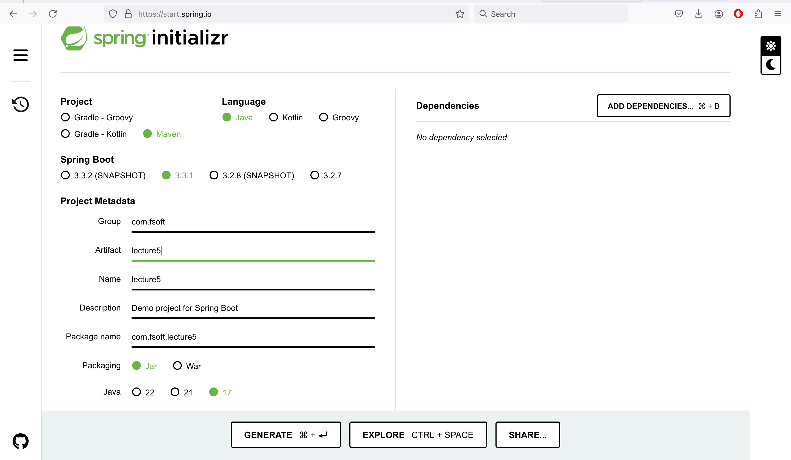
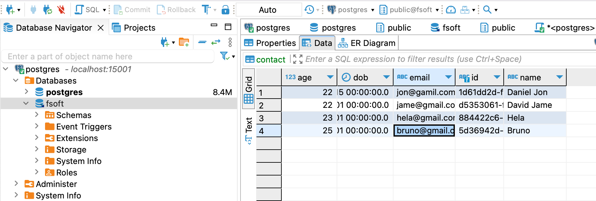
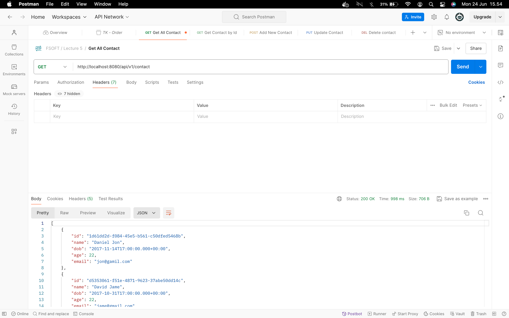
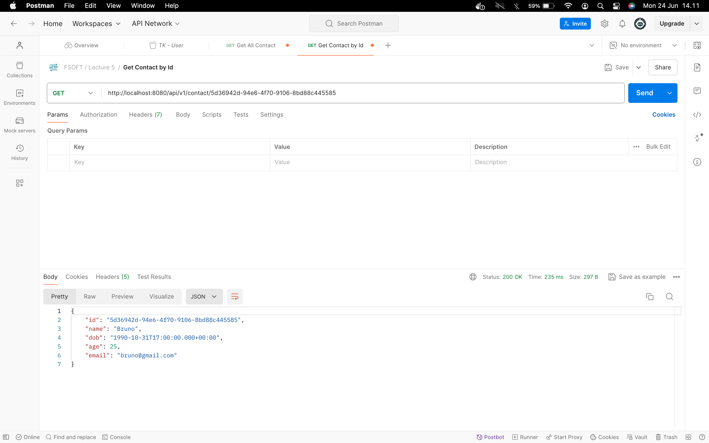
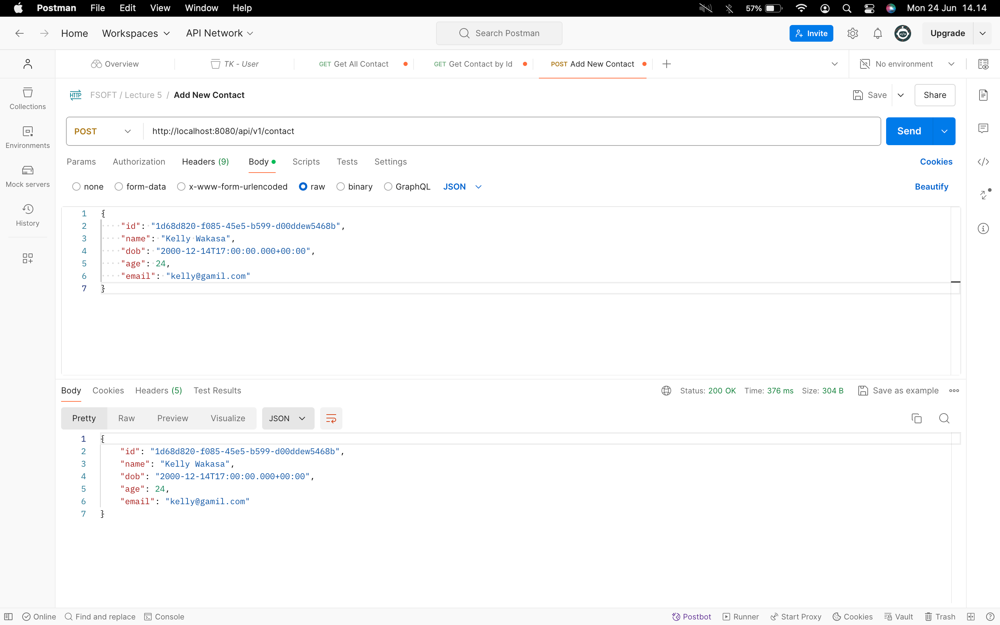
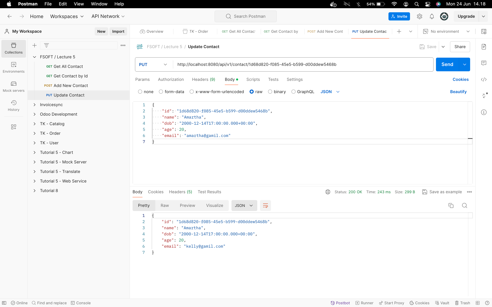
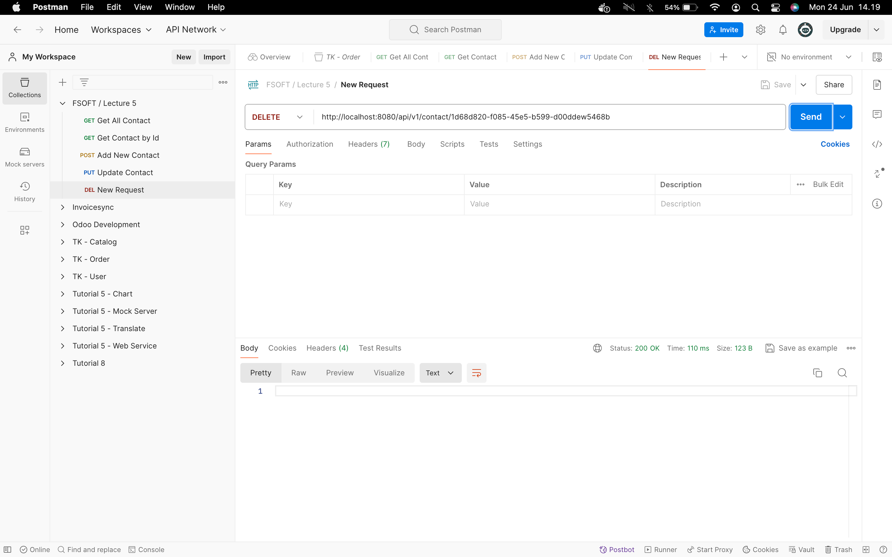

<h2>Snapshots</h2>

### Getting started

### Add maven dependencies
See [pom.xml](lecture5/pom.xml) in project.

### Init database

### Configure properties
See [application.properties](lecture5/src/main/resources/application.properties) in project.

### Create model
[Contact.java](lecture5/src/main/java/com/fsoft/lecture5/model/Contact.java)

### Create jpa repository
[ContactRepository.java](lecture5/src/main/java/com/fsoft/lecture5/repository/ContactRepository.java)

### Create controller
[ContactController.java](lecture5/src/main/java/com/fsoft/lecture5/controller/ContactController.java)

### Route testing
1. **Get all contact contact**

2. **Find contact by id**

3. **Add contact**

4. **Update contact**

5. **Delete contact**

