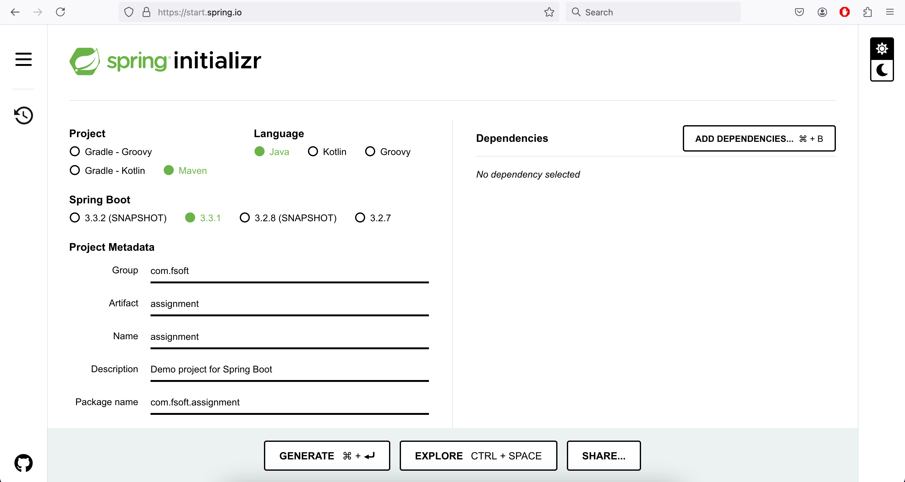
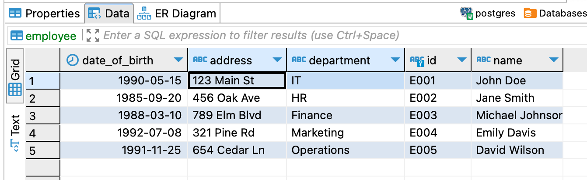
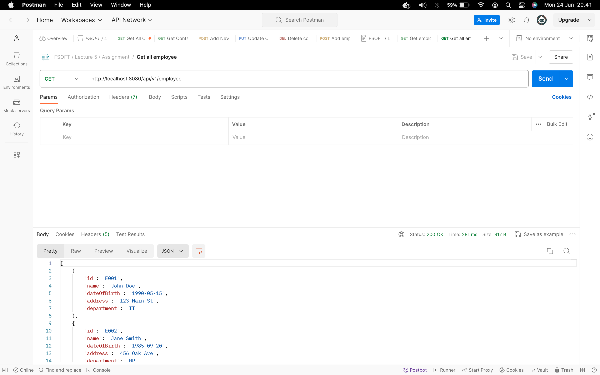
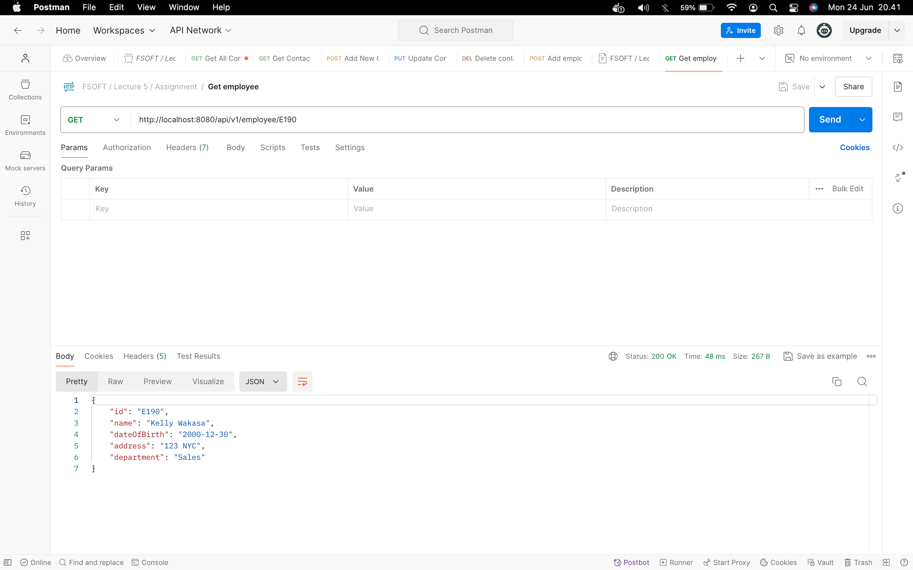
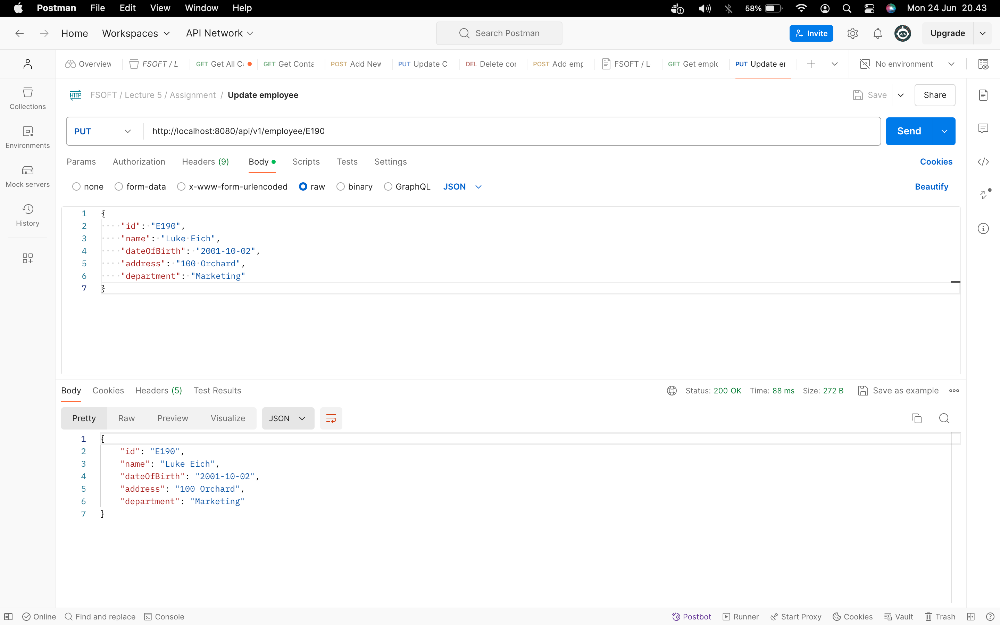
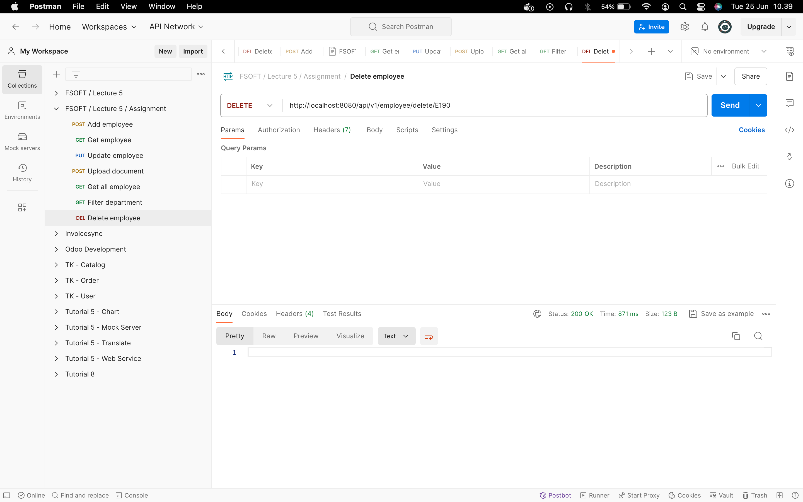
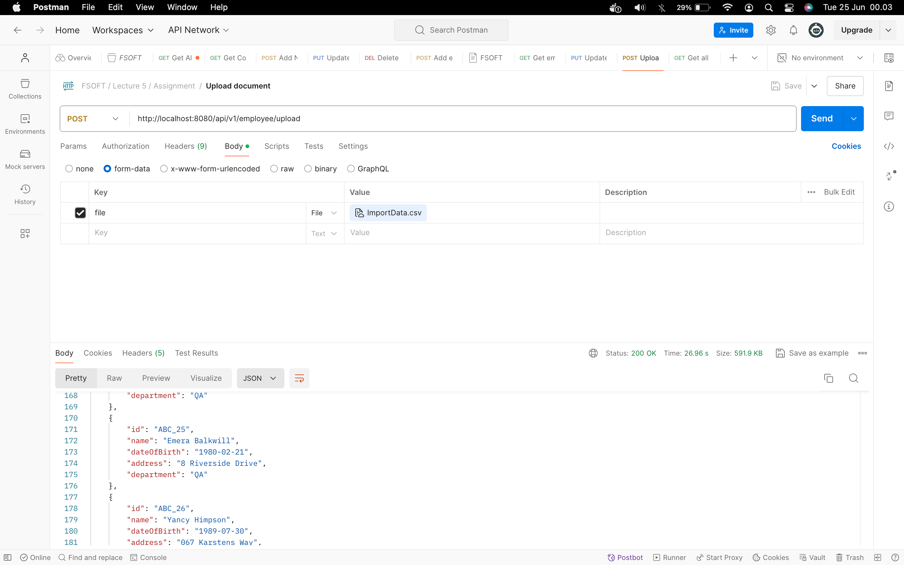
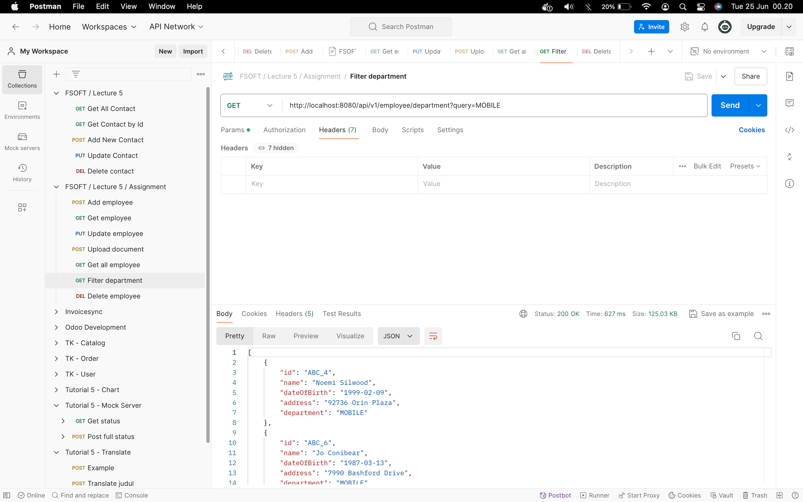

<h2>Create Spring project</h2>

### Getting started


### Add maven dependencies
See [pom.xml](assignment/pom.xml) in project.

### Init database
```sql
INSERT INTO employee (id, name, date_of_birth, address, department) VALUES
    ('E001', 'John Doe', '1990-05-15', '123 Main St', 'IT'),
    ('E002', 'Jane Smith', '1985-09-20', '456 Oak Ave', 'HR'),
    ('E003', 'Michael Johnson', '1988-03-10', '789 Elm Blvd', 'Finance'),
    ('E004', 'Emily Davis', '1992-07-08', '321 Pine Rd', 'Marketing'),
    ('E005', 'David Wilson', '1991-11-25', '654 Cedar Ln', 'Operations');
```


### Configure properties
See [application.properties](assignment/src/main/resources/application.properties) in project.

### Create model
[Employee.java](assignment/src/main/java/com/fsoft/assignment/model/Employee.java)

### Create jpa repository
[EmployeeRepository.java](assignment/src/main/java/com/fsoft/assignment/repository/EmployeeRepository.java)

### Create controller
[EmployeeController.java](assignment/src/main/java/com/fsoft/assignment/controller/EmployeeController.java)

1. **[GET] Get all employees**

This route will return list of employees stored in database. 


2. **[POST] Add new employee**

This route will return new added employee.


3. **[GET] Get employee by id**

This route will return a employee with same id as inputted.


4. **[PUT] Update employee**

This route will return an updated employee data as inputted.


5. **[DELETE] Delete employee**

This route will delete an employee with same id as inputted.


6. **[POST] Upload employees**

This route will return list of employees after read data from csv file.


7. **[GET] Find employee by department**

This route will return list of employees in same department as inputted.



